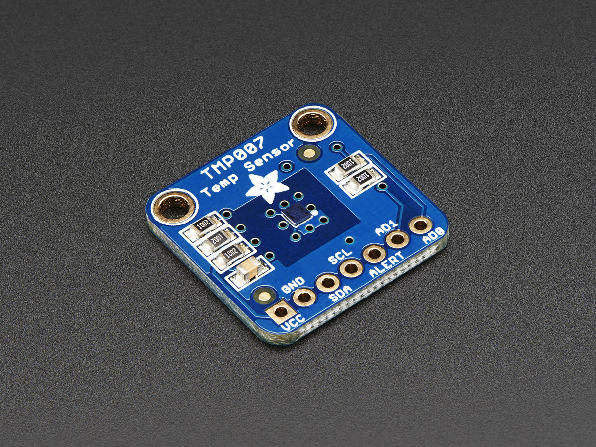

# Adafruit TMP007 Infrared Thermopile Sensor 

This is a library for the Adafruit TMP007 Infrared Thermopile Sensor

Pick one up today in the adafruit shop!
  * https://www.adafruit.com/products/2023

These displays use I2C to communicate, 2 pins are required to interface

Adafruit invests time and resources providing this open source code, please support Adafruit and open-source hardware by purchasing products from Adafruit!

Written by Limor Fried/Ladyada  for Adafruit Industries. BSD license, check license.txt for more information. 

All text above must be included in any redistribution

To install, use the Arduino Library Manager and search for "Adafruit TMP007 Library" and install the library.
